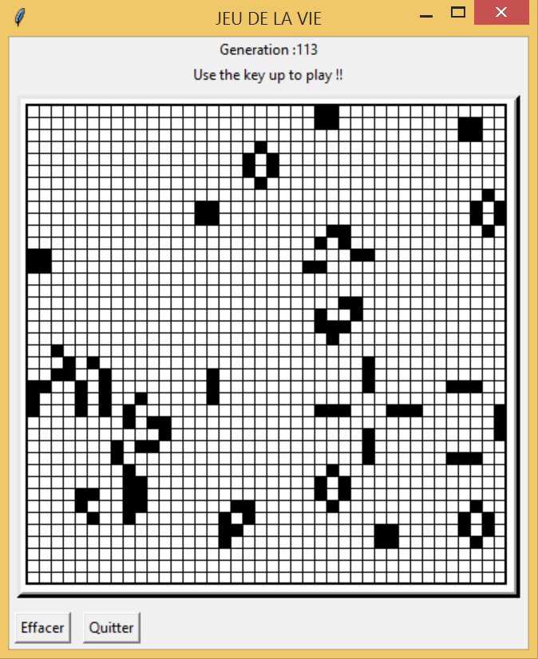
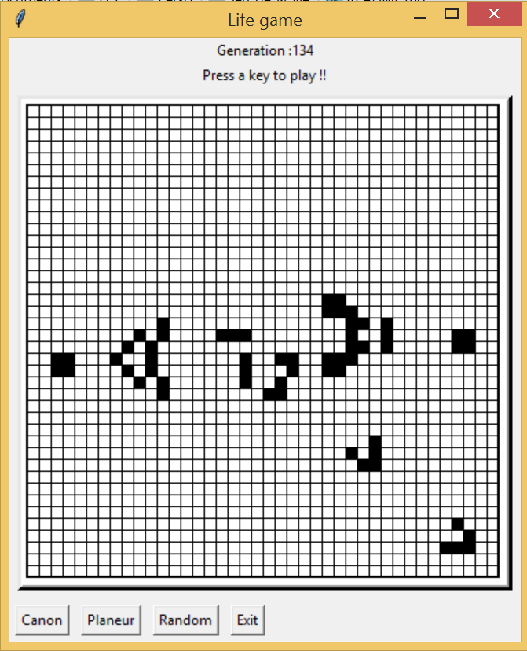

# Jeu de la vie

Implementation of the game of life with Python and the graphical interface Tkinter

This code allows you to create a grid with black and white squares, randomly defined. Then, with the key up, you can play the life game.

This project has been implemented after the discovery of the game and has no other goal than trying it.

The game allows you to generate a random grid, with both alive and dead units. You can also choose different interesting figures as the "gliders" or the "cannon" (which generate gliders).

## Game demonstration

You can see examples of the game with the random mode and the cannon.

